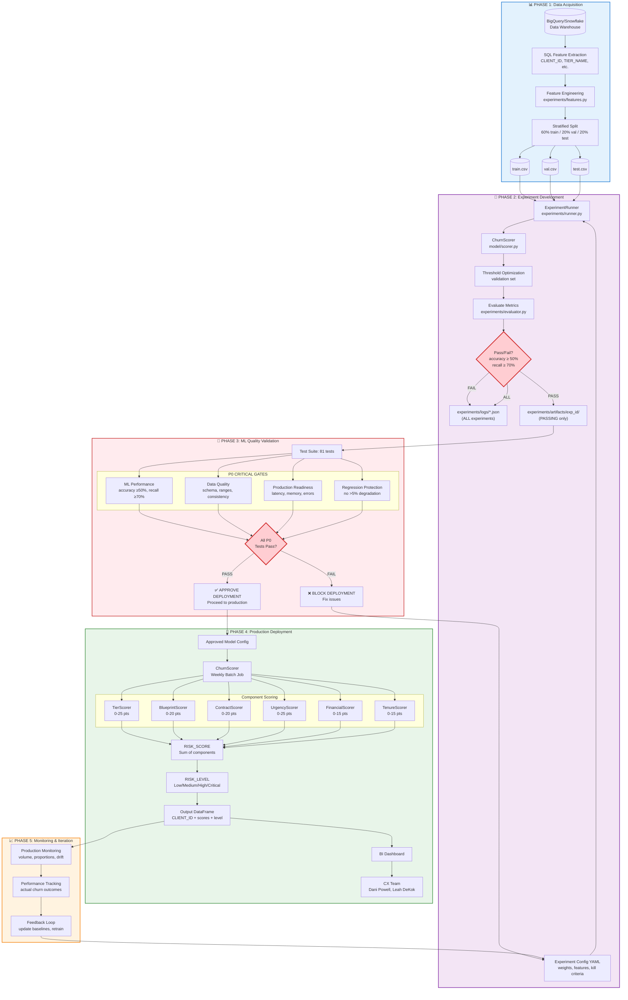

# End-to-End Churn Prediction Workflow

**Complete system workflow from data acquisition through production deployment and monitoring**

This diagram shows how the churn prediction system operates end-to-end, integrating data pipelines, experiment development, ML quality testing, production deployment, and continuous monitoring.

**Related Diagrams:**
- [Experiment Pipeline](experiment-pipeline.md) - Detailed experiment workflow
- [Scoring V3 Overview](scoring-v3-overview.md) - Component architecture details
- [Scoring Components](scoring-v3-components.md) - Weight breakdown

---

## Master Workflow Diagram



---

## Phase 1: Data Acquisition & Preparation

**Purpose:** Transform raw warehouse data into ML-ready train/val/test datasets

### Process Flow
1. **Extract features** from BigQuery/Snowflake using SQL queries
2. **Engineer features** using [experiments/features.py](../../experiments/features.py):
   - `IS_FIRST_CONTRACT` - Binary flag for first contract
   - `TENURE_BUCKET` - Categorical tenure grouping
   - `CORE_SINGLE_EXPOSURE` - Interaction: Core tier + single blueprint
   - `NEW_SHORT_CONTRACT_RISK` - Interaction: new client + short contract
   - `CONTRACTS_COMPLETED` - Historical renewal count
3. **Stratified split** to maintain churn rate proportions (60/20/20)

### Key Files
- [experiments/features.py](../../experiments/features.py) - Feature engineering logic
- [experiments/data/train.csv](../../experiments/data/train.csv) - Training data (60%)
- [experiments/data/val.csv](../../experiments/data/val.csv) - Validation data (20%)
- [experiments/data/test.csv](../../experiments/data/test.csv) - Test data (20%)
- [experiments/data/TRANSFORMATIONS.md](../../experiments/data/TRANSFORMATIONS.md) - Feature mapping documentation

### Success Criteria
- ✅ No data leakage between splits (CLIENT_ID overlap = 0)
- ✅ Balanced churn rates across splits (20-60% range)
- ✅ All required features present in each split
- ✅ Data quality checks pass (no negatives, reasonable ranges)

### Common Issues
- **Overlapping CLIENT_IDs**: Check split logic preserves uniqueness
- **Unbalanced splits**: Verify stratification on `IS_CHURN` column
- **Missing features**: Ensure feature engineering runs before split

---

## Phase 2: Experiment Development

**Purpose:** Develop and validate model configurations using controlled experiments

### Process Flow
1. **Define experiment** in YAML config ([experiments/configs/](../../experiments/configs/))
   - Select features to use
   - Set component weights
   - Define kill criteria (min_accuracy, min_recall)
   - Choose optimization metric (F1, accuracy, etc.)
2. **Run experiment** via [ExperimentRunner](../../experiments/runner.py)
   - Load train/val/test datasets
   - Apply [ChurnScorer](../../model/scorer.py) to all splits
   - Optimize threshold on validation set
   - Evaluate final metrics on test set
3. **Pass/Fail check** against kill criteria
4. **Store results**:
   - ALL experiments → `experiments/logs/*.json` (for tracking)
   - PASSING only → `experiments/artifacts/exp_id/` (full artifacts)

### Key Files
- [experiments/runner.py](../../experiments/runner.py) - ExperimentRunner orchestrator
- [experiments/evaluator.py](../../experiments/evaluator.py) - Metrics & threshold optimization
- [experiments/config.py](../../experiments/config.py) - ExperimentConfig definitions
- [experiments/logger.py](../../experiments/logger.py) - Logging infrastructure
- [experiments/artifacts.py](../../experiments/artifacts.py) - Artifact storage
- [model/scorer.py](../../model/scorer.py) - ChurnScorer implementation

### Commands
```bash
# Run single experiment
python -m experiments.run experiments/configs/v3_features.yaml

# Run multiple experiments
python -m experiments.run experiments/configs/*.yaml

# List all experiments
python -m experiments.run --list

# Compare experiments
python -m experiments.run --compare
```

### Success Criteria
- ✅ Experiment completes without errors
- ✅ Accuracy ≥ 50% (kill criteria)
- ✅ Recall ≥ 70% (catch churners)
- ✅ Threshold is stable across validation runs
- ✅ Artifacts saved for passing experiments

### Common Issues
- **Accuracy below 50%**: Adjust component weights or add features
- **Recall too low**: Lower threshold or increase urgency/financial weights
- **Inconsistent thresholds**: Check validation set size and distribution

---

## Phase 3: ML Quality Validation (Testing Gates)

**Purpose:** Enforce quality gates to prevent production failures

### Process Flow
1. **Run test suite** (81 tests across 7 categories)
2. **P0 Critical Gates** (must ALL pass):
   - **ML Performance**: [tests/test_ml_quality.py](../../tests/test_ml_quality.py)
     - Accuracy ≥ 50% (kill criteria)
     - Recall ≥ 70% (catch churners)
     - F1 ≥ 0.45
     - Threshold stability
   - **Data Quality**: [tests/test_data_quality.py](../../tests/test_data_quality.py)
     - Schema validation (Pandera)
     - Range checks (no negatives, reasonable maxes)
     - Consistency (no duplicates, logical relationships)
   - **Production Readiness**: [tests/test_production.py](../../tests/test_production.py)
     - Performance: 10K clients in <5 seconds
     - Memory: <500MB for 10K clients
     - Error handling: Clear, actionable messages
   - **Regression Protection**: [tests/test_regression.py](../../tests/test_regression.py)
     - No >5% accuracy degradation from baseline
     - No >3% recall degradation (critical metric)
     - Deterministic scoring (same input = same output)
3. **Gate decision**:
   - PASS → Approve deployment to production
   - FAIL → Block deployment, return to Phase 2 to fix issues

### Key Files
- [tests/test_ml_quality.py](../../tests/test_ml_quality.py) - ML performance gates
- [tests/test_data_quality.py](../../tests/test_data_quality.py) - Schema validation
- [tests/test_production.py](../../tests/test_production.py) - Performance gates
- [tests/test_regression.py](../../tests/test_regression.py) - Regression protection
- [tests/test_integration.py](../../tests/test_integration.py) - End-to-end tests
- [tests/fixtures/baseline_metrics.json](../../tests/fixtures/baseline_metrics.json) - Performance baselines
- [model/schemas.py](../../model/schemas.py) - Pandera schema definitions
- [TESTING.md](../../TESTING.md) - Comprehensive testing guide

### Commands
```bash
# Run all P0 critical tests
pytest tests/test_ml_quality.py::TestModelPerformance -v
pytest tests/test_data_quality.py -v
pytest tests/test_production.py::TestProductionPerformance -v
pytest tests/test_regression.py -v

# Run all tests with coverage
pytest tests/ --cov=model --cov=experiments --cov-report=html
```

### Success Criteria
- ✅ All 30 existing tests still pass (backward compatibility)
- ✅ All P0 ML performance tests pass
- ✅ All P0 data quality tests pass
- ✅ All P0 production readiness tests pass
- ✅ All P0 regression tests pass
- ✅ Test coverage >80%

### Common Issues
- **Performance regression**: Check if code changes introduced inefficiencies
- **Schema validation failure**: Verify data source hasn't changed
- **Memory spike**: Look for non-vectorized operations or data copies

---

## Phase 4: Production Deployment

**Purpose:** Deploy approved model configuration for weekly batch scoring

### Process Flow
1. **Load approved config** (validated in Phase 3)
2. **Run ChurnScorer** weekly via batch job (SQL + cron)
3. **Parallel component scoring**:
   - [TierScorer](../../model/components/tier.py) → 0-25 points
   - [BlueprintScorer](../../model/components/blueprint.py) → 0-20 points
   - [ContractScorer](../../model/components/contract.py) → 0-20 points
   - [UrgencyScorer](../../model/components/urgency.py) → 0-25 points
   - [FinancialScorer](../../model/components/financial.py) → 0-15 points
   - [TenureScorer](../../model/components/tenure.py) → 0-15 points
4. **Aggregate** → RISK_SCORE (0-120)
5. **Classify** → RISK_LEVEL:
   - Low: 0-30
   - Medium: 31-60
   - High: 61-90
   - Critical: 91+
6. **Output** to BI Dashboard for CX team

### Key Files
- [model/scorer.py](../../model/scorer.py) - ChurnScorer orchestrator
- [model/config.py](../../model/config.py) - ScoringConfig with thresholds
- [model/components/](../../model/components/) - Individual scorer implementations
- [model/schemas.py](../../model/schemas.py) - Optional input validation

### Commands
```python
from model import ChurnScorer

# Score batch of clients
scorer = ChurnScorer()
result = scorer.score(df)

# Get high-risk clients
high_risk = result.get_high_risk("High")

# Get summary statistics
summary = result.summary()
```

### Success Criteria
- ✅ Weekly batch completes in <5 seconds for expected volume
- ✅ 300-500 clients scored (expected range)
- ✅ 10-30% flagged as high-risk
- ✅ No duplicate CLIENT_IDs in output
- ✅ All scores within configured bounds

### Common Issues
- **Slow performance**: Check for row-by-row operations instead of vectorized
- **Unexpected high-risk %**: Review threshold settings or recent data changes
- **Missing clients**: Verify upstream data pipeline is complete

---

## Phase 5: Monitoring & Iteration

**Purpose:** Track production performance and continuously improve the model

### Process Flow
1. **Production Monitoring**:
   - Output volume (300-500 clients expected)
   - High-risk proportion (10-30% expected)
   - Score distribution (detect drift)
   - No duplicate clients
2. **Performance Tracking**:
   - Actual churn outcomes vs. predictions
   - Model accuracy over time
   - Precision/recall trends
   - False positive analysis (wasted CX outreach)
3. **Feedback Loop**:
   - Update baseline metrics if legitimate improvement
   - Retrain with new data
   - Adjust thresholds if business needs change
   - Add new features if valuable patterns emerge
4. **Iterate** → Loop back to Phase 2 with new experiment

### Key Files
- [tests/test_production.py](../../tests/test_production.py) - Production monitoring tests
- [tests/fixtures/baseline_metrics.json](../../tests/fixtures/baseline_metrics.json) - Baseline updates
- [experiments/logs/](../../experiments/logs/) - Experiment history

### Success Criteria
- ✅ Actual churn rate matches predicted high-risk %
- ✅ CX team adoption >30% WAU
- ✅ No degradation in accuracy over time
- ✅ Baseline metrics updated quarterly

### Common Issues
- **Drift detection**: Data distribution has changed, may need retraining
- **Accuracy decline**: Business processes may have changed, add new features
- **Low adoption**: CX team needs better dashboard or training

---

## Legend

### Symbol Guide
- **Cylinder** 🗄️ - Data storage (files, databases)
- **Rectangle** 📄 - Process or component
- **Diamond** 💎 - Decision point / gate
- **Subgraph** 📦 - Logical grouping of related steps

### Color Coding
- **Blue** - Data acquisition and preparation
- **Purple** - Experimentation and development
- **Red** - Testing gates (critical path)
- **Green** - Production deployment
- **Yellow** - Monitoring and iteration

### File Path Cheat Sheet
```
Key Files Quick Reference:

📊 Data:
  experiments/data/train.csv
  experiments/data/val.csv
  experiments/data/test.csv

🔬 Experimentation:
  experiments/runner.py
  experiments/evaluator.py
  experiments/configs/*.yaml

🧪 Testing:
  tests/test_ml_quality.py
  tests/test_data_quality.py
  tests/test_production.py
  tests/test_regression.py
  TESTING.md

🚀 Production:
  model/scorer.py
  model/config.py
  model/components/*.py
  model/schemas.py

📈 Documentation:
  CLAUDE.md - Project context
  README.md - Quick start
  docs/diagrams/ - All diagrams
```

---

## Quick Reference Commands

### Running Experiments
```bash
# Single experiment
python -m experiments.run experiments/configs/v3_features.yaml

# Multiple experiments
python -m experiments.run experiments/configs/*.yaml

# List all experiments
python -m experiments.run --list

# Compare experiments
python -m experiments.run --compare
```

### Running Tests
```bash
# All P0 critical tests (pre-deployment gate)
pytest tests/test_ml_quality.py::TestModelPerformance -v
pytest tests/test_data_quality.py -v
pytest tests/test_production.py::TestProductionPerformance -v

# All tests with coverage
pytest tests/ --cov=model --cov=experiments --cov-report=html

# Specific test category
pytest tests/test_ml_quality.py -v
```

### Production Scoring
```python
from model import ChurnScorer

# Load and score clients
scorer = ChurnScorer()
result = scorer.score(df)

# Filter high-risk
high_risk = result.get_high_risk("High")

# Get summary
summary = result.summary()
```

---

## Integration Points

### Data Handoff: Phase 1 → Phase 2
- **Format**: CSV files (train.csv, val.csv, test.csv)
- **Schema**: Defined in [model/schemas.py](../../model/schemas.py)
- **Validation**: Checked by Pandera in Phase 3

### Experiment → Testing: Phase 2 → Phase 3
- **Passing criteria**: accuracy ≥ 50%, recall ≥ 70%
- **Artifacts**: Stored in `experiments/artifacts/exp_id/`
- **Gate**: All P0 tests must pass

### Testing → Production: Phase 3 → Phase 4
- **Approval**: Green checkmark from all P0 gates
- **Deployment**: Copy approved config to production environment
- **Monitoring**: Phase 5 tracks performance

### Monitoring → Iteration: Phase 5 → Phase 2
- **Feedback**: Update baselines, identify new features
- **Retrain**: New data triggers new experiments
- **Continuous improvement**: Quarterly model updates

---

## Related Documentation

**Project Context:**
- [CLAUDE.md](../../CLAUDE.md) - Project overview and team conventions
- [TESTING.md](../../TESTING.md) - Comprehensive testing guide for Laura and team
- [README.md](../../README.md) - Quick start and basic usage

**Other Diagrams:**
- [Experiment Pipeline](experiment-pipeline.md) - Detailed experiment workflow
- [Scoring V3 Overview](scoring-v3-overview.md) - Component architecture
- [Scoring Components](scoring-v3-components.md) - Weight breakdown

**Technical Details:**
- [Model Explanation](../model-explanation.md) - Deep dive on scoring logic
- [Repository Overview](../repo-overview.md) - Repository structure

**Data Analysis:**
- [EDA Churn](../../EDA-Churn.md) - Exploratory data analysis findings

---

**Last Updated:** 2026-02-01
**Owner:** Jay Diaz (Director AI/ML)
**Reviewer:** Laura (Junior DS Lead)
**For:** CX Team (Dani Powell, Leah DeKok) and wider team reference
